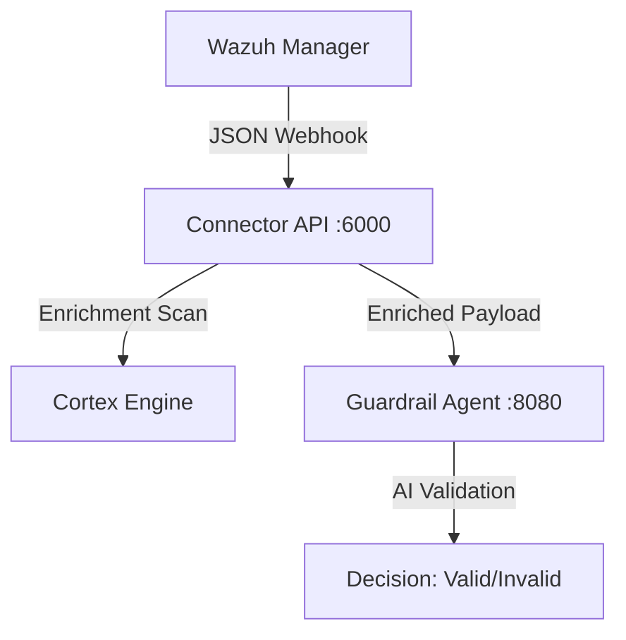

# Wazuh-Cortex AI Guardrail Bridge

This project implements a modern security orchestration pipeline. It acts as a middleware that receives alerts from Wazuh, enriches them using Cortex (TheHive Project), and forwards the context to an AI Guardrail for automated decision-making.

## 🏗️ Architecture



## 🚀 Features

- **Wazuh Integration**: Accepts standard Wazuh JSON alerts via Webhook
- **Auto-Enrichment**: Automatically extracts IPs and File Hashes and submits them to Cortex Analyzers (VirusTotal, AbuseIPDB, etc.)
- **AI-Ready**: Formats the alert context + threat intelligence reports into a clean prompt for an LLM/AI Agent
- **Dockerized**: Full stack (Connector, Cortex, ElasticSearch, Guardrail) runs in a single docker-compose command

## 📋 Prerequisites

- Docker & Docker Compose
- (Optional) curl for testing

## 🛠️ Quick Start

### 1. Clone the Repository

```bash
git clone https://github.com/yourusername/wazuh-cortex-bridge.git
cd wazuh-cortex-bridge
```

### 2. Configure Environment

Create a `.env` file in the root directory:

```ini
# .env content

# Connector Port
PORT=6000

# Cortex Configuration (Internal Docker Network)
CORTEX_URL=http://cortex:9001
CORTEX_API_KEY=changeme  # You will generate this in step 4

# Guardrail Configuration
GUARDRAIL_URL=http://guardrail:8080/validate
```

### 3. Start the Stack

Build and start all services (Connector, Cortex, ElasticSearch, Guardrail):

```bash
docker-compose up -d --build
```

> **Note**: Wait ~60 seconds for ElasticSearch and Cortex to initialize.

### 4. ⚠️ First Time Setup (Important!)

Before the system works, you must initialize the Cortex database:

1. Open your browser to `http://localhost:9001`
2. Click **"Update Database"** (Wait for migration to finish)
3. Create an Admin Account (e.g., `admin` / `admin1234`)
4. Log in and go to **Organization** (Building Icon) > **Users**
5. Click **+ Add User**:
   - Login: `bot`
   - Roles: Select `read` AND `analyze`
6. Click the new user row, then click **"Create API Key"**
7. Copy the API Key
8. Update your `.env` file with the new key and restart:

```bash
# Update .env
CORTEX_API_KEY=your_new_long_key

# Restart connector
docker-compose restart connector
```

## 🧪 How to Test

Send a simulated Wazuh alert to the connector to verify the pipeline:

```bash
curl -X POST http://localhost:6000/webhook/alert \
  -H "Content-Type: application/json" \
  -d '{
  "alert_id": "test-malware-01",
  "received_at": "2025-12-06T18:00:00Z",
  "source": "wazuh",
  "severity": "high",
  "summary": "Mimikatz Activity Detected",
  "host": { "id": "001", "hostname": "victim-pc", "ip": "8.8.8.8" },
  "actor": { "user": "admin", "uid": "500" },
  "event": { "rule_id": 1, "process_name": "mimikatz.exe", "command_line": "mimikatz.exe privilege::debug" },
  "artifacts": [
    { "type": "file", "sha256": "33f538e8d46114a84920678255d64472" }
  ],
  "suggested_actions": [
    { "id": "isolate_host", "label": "Isolate Host Network" }
  ]
}'
```

### Check Logs

```bash
docker-compose logs -f connector
```

**Success Output:**
```
[*] Processing test-malware-01...
[*] Cortex initialized at http://cortex:9001
[*] Forwarding to Guardrail at http://guardrail:8080/validate...
[*] Guardrail Response: 200
```

## 📂 Project Structure

```
.
├── docker-compose.yml   # Orchestration for all services
├── .env                 # Configuration variables
├── Dockerfile           # Builds the Python environment
├── main.py              # The Connector (Wazuh Receiver -> Cortex)
├── mock_guardrail.py    # The Mock AI Agent (Receiver)
└── requirements.txt     # Python dependencies
```

## 🧩 Customization

### Integrating Real AI (OpenAI/Ollama)

The current setup uses `mock_guardrail.py`. To use a real LLM:

1. Open `docker-compose.yml`
2. Change `command: python mock_guardrail.py` to `command: python real_guardrail.py`
3. Add your LLM logic in `real_guardrail.py` to process the JSON received from the connector

### Enabling Cortex Analyzers

To have Cortex actually scan files (VirusTotal, etc.):

1. Log in to `http://localhost:9001`
2. Go to **Organization** > **Analyzers**
3. Enable `VirusTotal_GetReport_3_0` (requires a free VT API key)
4. The connector will automatically start using it for any file or hash artifacts in the JSON

## 📝 License

This project is licensed under the MIT License.

## 🤝 Contributing

Contributions are welcome! Please feel free to submit a Pull Request.

## 📧 Support

For issues and questions, please open an issue on GitHub.# Wazuh-Cortex-AI-Guardrail-Bridge
